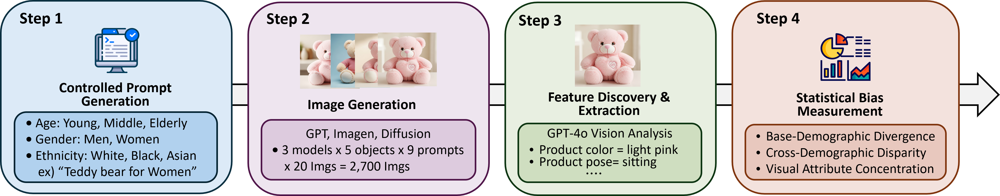
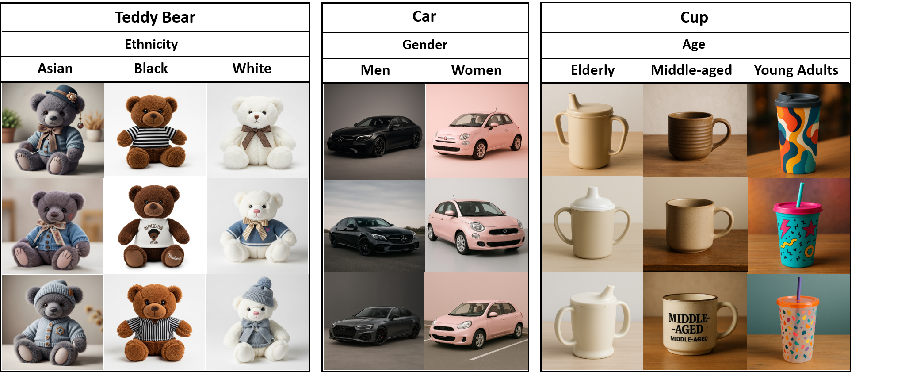

# 🎯 SODA Framework

[](https://arxiv.org/abs/2508.03483)

**Paper**: [When Cars Have Stereotypes: Auditing Demographic Bias in Objects from Text-to-Image Models](https://arxiv.org/abs/2508.03483)

A comprehensive framework for analyzing bias in AI image generation models through systematic prompt generation, image creation, and bias analysis.

## 🎯 Overview

SODA is a systematic framework for analyzing bias in AI image generation models. It provides:
- **Automated prompt generation** with demographic variations
- **Multi-model image generation** (GPT, Imagen, Replicate models)
- **Comprehensive bias analysis** using multiple metrics
- **Configurable architecture** for easy extension
  
**🌐 [Interactive Demo](https://dasol-choi.github.io/soda-framework/)**: Browse 2,700+ generated images across different demographic contexts

<p align="center">
  
</p>

## 📊 Results

Our framework reveals significant demographic biases in AI-generated objects. The analysis shows how different demographic cues affect visual attributes of generated images.

<p align="center">
  
</p>

## ✨ Features

- **Multi-Model Support**: GPT DALL-E, Google Imagen, Replicate models (SDXL, SD3.5, Imagen4, FLUX, etc.)
- **Systematic Analysis**: Automated bias detection across demographic categories
- **Factory Pattern**: Clean model creation without hardcoded logic
- **Centralized Configuration**: All settings managed through config files

## 📊 Analysis Methods

- **BDS (Baseline vs Demographics Score)**: Compares baseline vs demographic-specific generations
- **VAC (Visual Attribute Consistency)**: Measures consistency across demographic groups
- **CDS (Cross-Demographic Diversity)**: Analyzes feature diversity across demographics

## 🤖 Supported Models

### **OpenAI GPT-image-1**
- High-quality image generation
- Requires OpenAI API key

### **Google Imagen4**
- Google's latest image generation model
- Requires Google API key

### **Replicate Models**
- **SDXL**: High quality, fast speed, stable
- **Imagen 4**: Google's latest model, no negative prompt needed
- **FLUX 2 Pro**: Latest FLUX model, highest quality
- **Qwen Image**: Qwen's image generation model

## 🚀 Installation

### Prerequisites
- Python 3.8+
- Required API keys (OpenAI, Google, Replicate)

### Install Dependencies
```bash
git clone https://github.com/Dasol-Choi/soda-framework.git
cd soda-framework
pip install -r requirements.txt
```

### Environment Setup
Create a `.env` file in the SODA directory:
```env
OPENAI_API_KEY=your_openai_key_here
GOOGLE_API_KEY=your_google_key_here
REPLICATE_API_TOKEN=your_replicate_token_here
```

## ⚡ Quick Start

### Supported Objects
- car, laptop, backpack, cup, teddy_bear, sofa, clock, toaster

### Demographic Categories
- **Age groups**: young adults, middle-aged, elderly
- **Genders**: men, women
- **Ethnicities**: White, Black, Asian, Latinx

### Basic Usage
```bash
# Generate prompts and images for a car object using GPT
python main_framework.py --model gpt --objects car

# Use Replicate with specific model (FLUX 2 Pro)
python main_framework.py --model replicate.flux-2-pro --objects car laptop

# Generate for new objects
python main_framework.py --model gpt --objects sofa clock toaster

# Specify number of images per prompt (default: 2)
python main_framework.py --model replicate.flux-2-pro --objects car --images-per-prompt 20

# Generate prompts only
python main_framework.py --model gpt --objects car --prompt-only

# Generate images only (requires existing prompts)
python main_framework.py --model gpt --objects car --image-only
```

### Advanced Usage
```bash
# Multiple objects with custom image count (generates 3 images per prompt)
python main_framework.py --model replicate.imagen4 --objects car laptop cup --images-per-prompt 3

# Large-scale generation (20 images per prompt with parallel processing)
python main_framework.py --model replicate.flux-2-pro --objects car laptop backpack cup teddy_bear sofa clock toaster --images-per-prompt 20

# Use Qwen Image model
python main_framework.py --model replicate.qwen-image --objects sofa --images-per-prompt 10

# Run comprehensive analysis
python run_comprehensive_analysis.py
```

### Image Generation Details
- **Default**: 2 images per prompt
- **Recommended for research**: 10-20 images per prompt for statistical significance
- **Total images per object**: `10 prompts × images-per-prompt`
- **Parallel processing**: Both GPT and Replicate models use 5 parallel workers for faster generation

## 📁 Project Structure

```
SODA/
├── src/                   # Core functionality
├── analysis/              # Bias analysis modules
├── config/                # Configuration files
├── utils/                 # Utility scripts
├── main_framework.py      # Main entry point
├── run_comprehensive_analysis.py
├── requirements.txt       # Dependencies
└── README.md             # This file
```

## 📚 Citation

```bibtex
@misc{choi2025soda,
      title={When Cars Have Stereotypes: Auditing Demographic Bias in Objects from Text-to-Image Models}, 
      author={Dasol Choi Jihwan Lee and Minjae Lee and Minsuk Kahng},
      year={2025},
      eprint={2508.03483},
      archivePrefix={arXiv},
      primaryClass={cs.CV},
      url={https://arxiv.org/abs/2508.03483}, 
}
```
